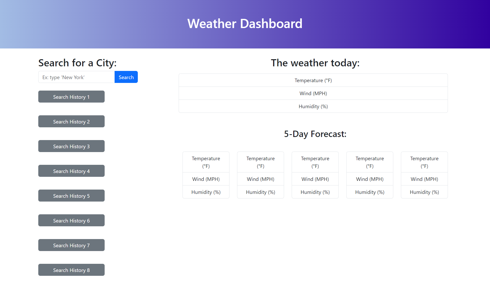
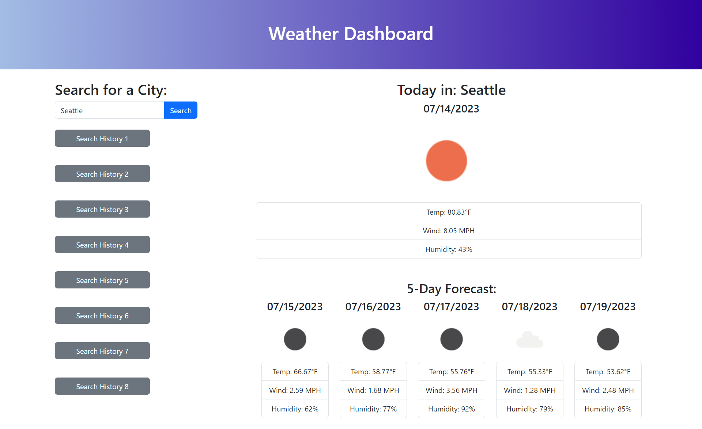
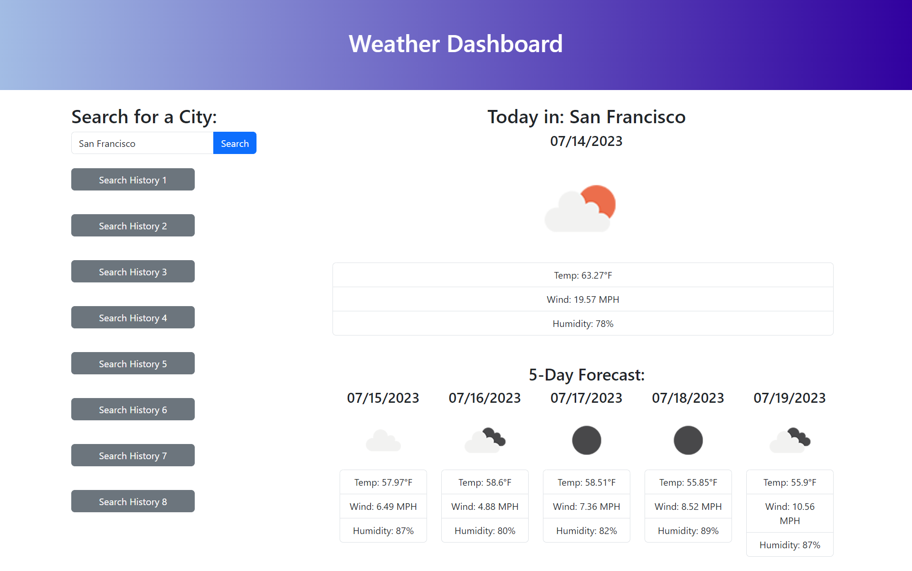

# weather-dashboard

## Description

The objective of this project was to enhance my skills in JavaScript, Bootstrap, APIs, and local storage. The goal of this project was to develop an intuitive application that allows users to search for any city and instantly retrieve the current weather conditions, along with a comprehensive 5-day weather forecast. With a focus on creating a user-friendly interface, the application will provide a seamless experience for users, enabling them to easily access and interpret weather information such as temperature, wind speed and humidity, in a visually appealing manner. By combining the power of JavaScript, Bootstrap's responsive design, and APIs for weather data retrieval, I have gained valuable hands-on experience in web development while delivering a practical and engaging application for users to stay informed about the weather.

## Installation

1. Created an html from scratch with a header, a side menu and a container
2. Created a reset.css file and linked it to HTML
3. Created a Javascript file and linked to HTML
4. Linked the Bootstrap framework to HTML
5. Created a title for the document on HTML
6. Added a header title and styled with bootstrap on HTML
7. Created a container box to wrap the side form on the left and the weather forecasts on the right, both in the same row, using Bootstrap on HTML
8. For the side menu form, adjusted on HTML the menu to take 1/3 of the page, created the title "search for a city", created a form for the user to input the desired city and created a search button
9. Also on the side menu form, created on HTML a list of buttons with previously searched cities, linked to the forecast of that city
10. On the forecast box on the right side, ajusted forecast to take 2/3 of the page with Bootstrap classes added to HTML
11. Added divs on HTML with dynamic parameters to today's forecast: city, date, image symbol of the weather, list with temp, wind and humidity
12. Created IDs to link and display updated info after search
13. Added dynamic parameters to 5-day forecast: date, image symbol of the weather, list with temp, wind and humidity
14. Created variable on Javascript to store API key obtained from the openweathermap website
15. Created variable on Javascript to store the name of the city searched
16. Created variable on Javascript to store API URL with current weather with query parameters concatenated (var formSearch, var weatherApiKey)
17. Created variable on Javascript to store API URL with 5-day forecast with query parameters concatenated (var formSearch, var weatherApiKey)
18. Created fetch command on Javascript to test the API key with the current day weather
19. Created a function on Javascript to link the data retrieved from current weather API to designated HTML elements
20. Created fetch command on Javascript to test the API key with the 5 day forecast
21. Created a function on Javascript to link the data retrieved from forecast weather API to designated HTML elements
22. Created command on Javascript to run the function displayWeather when the user clicks on the search button
23. Created variable empty array on Javascript to be filled with the searched city
24. Created for loop on Javascript to append the search history to local storage

## Usage

1. Open the following URL in the browser: https://virginiafreitas.github.io/weather-dashboard/
<!-- IN PROGRESS -->
<!-- 2. See that the third line of the header will be displaying the current date as MM-DD-YYYY.
3. Choose one time of the day, between 9am and 5pm, to add new activities or remove existing activities.
4. Activities can be typed inside the text area to the right side of the column with the hours of the day.
5. If the time of the day has already passed, the background color of the area to type the activity should be gray.
6. If the time of the day is the current time, the background color of the area to type the activity should be pink.
If the time of the day is in the future, the background color of the area to type the activity should be dark blue.
7. After adding or removing the activity, click on the black button to the right side, and it will be saved to the local storage.
8. Refresh the page to verify that any change will remain in its designated area. -->

 

 

 

 

 

## Credits

I have received advice from the UC Berkeley Extension tutors Kyle Vance on pseudocoding and Phillip Loy on developing the code.
I reached out to the Mozilla Developer webpage to learn how to use some of the functions. ( https://developer.mozilla.org/en-US/ )
<!-- I reached out to the Day.js webpage to learn how to use the tool. ( https://day.js.org/en/ ) -->

## License

    MIT License